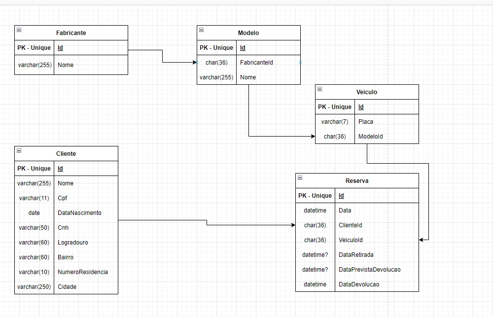

## **Sobre o projeto**

O Intuito do projeto é possibilitar cadastrar Clientes e Veículos e ter a opção de fazer reservas para locação de carros.

## **Como utilizar ?**

- ### **Passo 1**
  - Clone o repositório na sua máquina.
  - Tenha instalado o Docker, pode fazer o download por este link: [Download docker.](https://www.docker.com/products/docker-desktop/)
  - Após fazer o download e deixar o docker funcionando normalmente, baixe o arquivo yaml caso não tenha vindo quando clonou o repositório (Está na pasta raiz do projeto 'docker-compose.yaml') .
  - Abra o cmd na pasta que está o arquivo yaml e execute o comando  docker-compose up.
- ### **Passo 2**
    - Ops! acho que nem vamos precisar de outros passos... rsrs
    - Agora é só abrir no seu navegador 'http://localhost:5000/swagger/index.html'

## **Eu preciso baixar o repositório para testar ?**
Claro ... que não rsrs, caso voce não queira ter este trabalho, apenas acesse o link: [Api Swagger](https://srblink.vdintercambio.com/swagger/index.html)

## **Dados**
- Cliente
    - Cadastre um cliente para começar.
    - Voce pode consulta-lo por parte do seu nome ou parte do cpf também.
    - Também pode alterar o endereço dele, caso tenha digitado errado. 

- Veiculo
    - Cadastre um veiculo junto a um modelo e um fabricante (qualquer um que voce queira.) 
    - Também é possível consultar veículos pela placa, pode digitar só uma parte se voce não se lembrar dela completa.
    - Se preferir consultar todos os veículos por modelos ou fabricantes também é possível.

- Reserva
    - Voce pode reservar um veículo para um cliente, basta consultar o veiculo e o cliente que voce quer, pegar seus Ids e então cadastrar uma reserva.
    - Voce pode obter todas as reservas feitas dentro de um intervalo de datas.
    - Também pode consultar todas reservas de um cliente.
    - É possível também obter todas as reservas vencidas.
    - Pode atualizar a data de retirada do veiculo e a data prevista para devolver o veiculo caso queira.
    - E também pode finalizar a reserva.

## **Modelagem de dados**

Utilizei uma aplicação para me ajudar com a modelagem do banco de dados, pode ser acessada pelo link: [Site de diagramas](https://app.diagrams.net/)

E Assim ficou a modelagem de dados do projeto.

### **Este foi o projeto de locação de veículos, qualquer dúvida voce pode me encontrar aqui:** [Linkedin](https://www.linkedin.com/in/thyago-prado-2431b618a/)

## Obrigado!